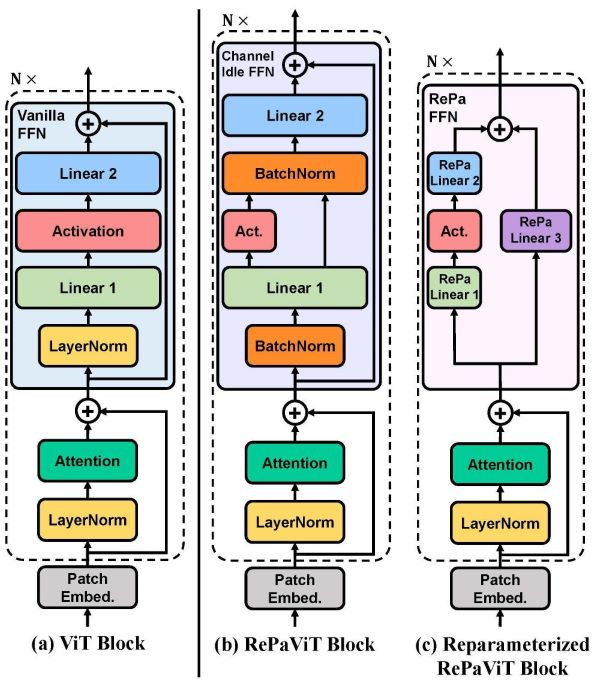
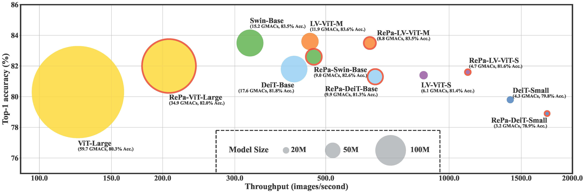

# RePaViT: Scalable Vision Transformer Acceleration via Structural Reparameterization on Feedforward Network Layers [ICML2025] [](https://arxiv.org/abs/2505.21847)

This is the official repository for __RePaViT__ 

<p align="center">

</p>

_(For RePa-LV-ViT source code, please refer to this [repo](https://github.com/Ackesnal/RePa-LV-ViT) as LV-ViT incorporates a different training framework. For dense prediction tasks, the code based on MMDetection and MMSegmentation is under construction. Pretrained model weights have been released [here](https://huggingface.co/Ackesnal/RePaViT).)_


## 0. Environment Setup

First, clone the repository locally:
```
git clone https://github.com/Ackesnal/RePaViT.git
cd RePaViT
```

Then, install environments via conda:
```
conda create -n repavit python=3.10 -y && conda activate repavit
conda install conda-forge::python-rocksdb -y
pip install torch torchvision torchaudio timm==1.0.3 einops ptflops wandb
```

__[Recommended]__ Alternatively, you can directly install from the pre-defined environment YAML file as:
```
conda env create -f environment.yml
```

After finishing the above installations, it is ready to run this repo.

We further utilize the [wandb](https://wandb.ai/site) for real-time tracking and training process visualization. The use of wandb is optional. However, you will need to register and login to wandb before using this functionality.

## 1. Dataset Preparation
Download and extract ImageNet train and val images from http://image-net.org/.
The directory structure is the standard layout for the torchvision `datasets.ImageFolder`, and the training and validation data is expected to be in the `train/` folder and `val` folder respectively:
```
/path/to/imagenet/
  train/
    class1/
      img1.jpeg
    class2/
      img2.jpeg
  val/
    class1/
      img3.jpeg
    class2/
      img4.jpeg
```

We provide support for [RocksDB](https://python-rocksdb.readthedocs.io/en/latest/) as an alternative dataset organization solution. In certain HPC environments where the number of allowable files is limited, the ImageNet dataset cannot be fully decompressed on high-speed I/O disks. In this case, RocksDB enables efficient and stable ImageNet data storing and loading, without the need for millions of small image files.

To insert ImageNet into a RocksDB database, simply run 
```
python insert_rocksdb.py
```
(please replace `tar_path_root` and `db_path_root` in [insert_rocksdb.py](https://github.com/Ackesnal/RePaViT/insert_rocksdb.py) with your own source and target root paths).

When training the model, use the `--rocksdb` argument instead of `--data_path` to specify the database location.

## 2. Training
### 2.1. Training on a single node

To train RePaViT on ImageNet on a single node with 8 gpus for 300 epochs without wandb logging, please refer to the command examples below.

__[RePaViT-Base]:__
```
torchrun --nproc_per_node=8 main.py \
  --model=RePaViT_Base \
  --batch_size=512 \
  --epochs=300 \
  --dist_eval \
  --channel_idle \
  --idle_ratio=0.75 \
  --feature_norm=BatchNorm \
  --data_path=/path/to/imagenet \
  --output_dir=/path/to/output \
  --lr=4e-3 \
  --min_lr=4e-5 \
  --warmup_lr=1e-6 \
  --warmup_epochs=20 \
  --unscale_lr \
  --weight_decay=0.05 \
  --opt=lamb \
  --drop_path=0.1
```

__[RePaViT-Large]:__
```
torchrun --nproc_per_node=8 main.py \
  --model=RePaViT_Large \
  --batch_size=512 \
  --epochs=300 \
  --dist_eval \
  --channel_idle \
  --idle_ratio=0.75 \
  --feature_norm=BatchNorm \
  --data_path=/path/to/imagenet \
  --output_dir=/path/to/output \
  --lr=1e-3 \
  --min_lr=5e-5 \
  --warmup_lr=1e-6 \
  --warmup_epochs=20 \
  --unscale_lr \
  --weight_decay=0.05 \
  --opt=lamb \
  --drop_path=0.3
```

`--channel_idle` and `--idle_ratio=0.75` are used to control channel idle mechanism in FFN layers. Please note that `--feature_norm=BatchNorm` must be added to facilitate full structural reparameterization.

If the computating resource is limited, you can add `--accumulation_steps` for training with a smaller batch size and gradient accumulation. (`--accumulation_steps` $\times$ `--batch_size` $\times$ `--nproc_per_node`) is the total batch size per batch.

For your convenience, we also provide one-line command below:
```
torchrun --nproc_per_node=8 main.py --model=RePaViT_Large --batch_size=512 --epochs=300 --dist_eval --channel_idle --idle_ratio=0.75 --feature_norm=BatchNorm --data_path=/path/to/imagenet --output_dir=/path/to/output --lr=1e-3 --min_lr=5e-5 --warmup_lr=1e-6 --warmup_epochs=20 --unscale_lr --weight_decay=0.05 --opt=lamb --drop_path=0.3
```

### 2.2. Track your training with wandb

To train with wandb tracking and visualization, `--wandb` argument with environment variable `WANDB_MODE` should be set. The project name is set to the model name by default. In addition, `--wandb_suffix` can be used to nominate a customized suffix for distinguishing different projects on the same model.

__[RePaViT-Large] with wandb:__
```
WANDB_MODE=online torchrun --nproc_per_node=8 main.py \
  --model=RePaViT_Large \
  --batch_size=512 \
  --epochs=300 \
  --dist_eval \
  --channel_idle \
  --idle_ratio=0.75 \
  --feature_norm=BatchNorm \
  --data_path=/path/to/imagenet \
  --output_dir=/path/to/output \
  --lr=1e-3 \
  --min_lr=5e-5 \
  --warmup_lr=1e-6 \
  --warmup_epochs=20 \
  --unscale_lr \
  --weight_decay=0.05 \
  --opt=lamb \
  --drop_path=0.3 \
  --wandb
  #--wandb_entity=your-entity-name \
  #--wandb_suffix=your-customized-suffix
```

Please note that `WANDB_MODE` MUST be set when using `--use_wandb`. You can choose `WANDB_MODE=online` for real-time tracking on the wandb dashboard, or `WANDB_MODE=offline` for local tracking and synchronize later. 

### 2.3. Training on multiple nodes

Distributed multi-node multi-GPU training is available via Slurm. We provide a sample Slurm script at [exec_config.sh](https://github.com/Ackesnal/RePaViT/exec_config.sh).

A sample code snippet of _exec_config.sh_ is as shown below:

```sh
#!/bin/bash
#SBATCH --nodes=8
#SBATCH --ntasks-per-node=2
#SBATCH --partition=gpu
#SBATCH --gres=gpu:2
#SBATCH --cpus-per-task=32
#SBATCH --mem-per-cpu=2G
#SBATCH --job-name=train
#SBATCH --time=1-00:00:00
#SBATCH -o RePaViT_Large_out.txt
#SBATCH -e RePaViT_Large_err.txt

# Load modules if needed
# e.g., `module load miniconda3`

# Activate conda environment if needed
# e.g., `conda activate repavit`

export BATCH_SIZE=4096
export MASTER_PORT=22222
export MASTER_ADDR=$(scontrol show hostnames $SLURM_JOB_NODELIST | head -n 1)
export WORLD_SIZE=$SLURM_NTASKS
export BATCH_SIZE=$(echo "scale=0; $BATCH_SIZE / $WORLD_SIZE" | bc)
export WANDB_MODE=online

srun --export=ALL python main.py \
    --model=RePaViT_Large \
    --batch_size=$BATCH_SIZE \
    --epochs=300 \
    --num_workers=20 \
    --dist_eval \
    --channel_idle \
    --idle_ratio=0.75 \
    --feature_norm=BatchNorm \
    --data_path=/path/to/imagenet \
    --output_dir=/path/to/output \
    --opt=lamb \
    --lr=1e-3 \
    --min_lr=5e-5 \
    --warmup_lr=1e-6 \
    --warmup_epochs=20 \
    --unscale_lr \
    --weight_decay=0.05 \
    --drop_path=0.3 \
    --wandb
    #--wandb_entity=your-entity-name \
    #--wandb_suffix=your-customized-suffix
```
where `--nodes` and `--gres` determines how many SLURM nodes and how many GPUs on each node you want to use. `--gres` should equal to `--ntasks-per-node`. The batch size of each parallel process will be automatically calculated based on the world size.

## 3. Evaluation
### 3.1. Accuracy evaluation

To evaluate the prediction performance, please run the following code. Please ensure `--idle_ratio` is set to the same value as the pretrained model weight.

__[RePaViT-Large] performance test:__
```
torchrun --nproc_per_node=4 main.py \
  --model=RePaViT_Large \
  --batch_size=512 \
  --eval \
  --dist_eval \
  --channel_idle \
  --idle_ratio=0.75 \
  --feature_norm=BatchNorm \
  --data_path=/path/to/imagenet \
  --resume=/path/to/pretrained_weight.pth
```

For your convenience, we also provide one-line command below:
```
torchrun --nproc_per_node=4 main.py --model=RePaViT_Large --batch_size=512 --eval --dist_eval --channel_idle --idle_ratio=0.75 --feature_norm=BatchNorm --data_path=/path/to/imagenet --resume=/path/to/pretrained_weight.pth
```

### 3.2. Inference speed test

To test inference speed, `--test_speed` and `--only_test_speed` arguments should be utilized, and the number of processes is recommended to set to 1:

__[RePaViT-Large] speed test:__
```
torchrun --nproc_per_node=1 main.py \
  --model=RePaViT_Large \
  --channel_idle \
  --idle_ratio=0.75 \
  --feature_norm=BatchNorm \
  --test_speed
```

For your convenience, we also provide one-line command below:
```
torchrun --nproc_per_node=1 main.py --model=RePaViT_Large --channel_idle --idle_ratio=0.75 --feature_norm=BatchNorm --test_speed
```

### 3.3. Evaluation with Structural Reparameterization

To enable inference-stage model compression via structural reparameterization, you can simply add the argument __`--reparam`__ as:

__[RePaViT-Large] speed test after structural reparameterization:__
```
torchrun --nproc_per_node=1 main.py \
  --model=RePaViT_Large \
  --channel_idle \
  --idle_ratio=0.75 \
  --feature_norm=BatchNorm \
  --test_speed \
  --reparam
```

For your convenience, we also provide one-line command below:
```
torchrun --nproc_per_node=1 main.py --model=RePaViT_Large --channel_idle --idle_ratio=0.75 --feature_norm=BatchNorm --test_speed --reparam
```

`--reparam` can be combined with performance evalutation as well. The prediction accuracy before and after reparameterization should be the same.


## 4. Supported Models

In this repo, we currently support the following backbone model(name)s:

* RePaViT-Tiny _(i.e., RePaDeiT-Tiny)_
* RePaViT-Small _(i.e., RePaDeiT-Small)_
* RePaViT-Base _(i.e., RePaDeiT-Base)_
* RePaViT-Large
* RePaViT-Huge
* RePaSwin-Tiny
* RePaSwin-Small
* RePaSwin-Base

<p align="center">

</p>

We have also provided the implementation on MLPMixer and PoolFormer but have not tested them. The support for more backbones will be included in our future work.

## 5. Pretrained Weights
All current pretrained weights are available on __[Hugging Face](https://huggingface.co/Ackesnal/RePaViT/tree/main)__.

## 6. License
This repository is released under the Apache 2.0 license as found in the [LICENSE](LICENSE) file.

## 7. Reference
If you use this repo or find it useful, please consider citing:
```
@inproceedings{xu2025repavit,
  title = {RePaViT: Scalable Vision Transformer Acceleration via Structural Reparameterization on Feedforward Network Layers},
  author = {Xu, Xuwei and Li, Yang and Chen, Yudong and Liu, Jiajun and Wang, Sen},
  booktitle = {The 42nd International Conference on Machine Learning (ICML)},
  year = {2025}
}
```
